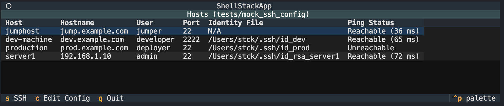

# shell-stack

## Shell Stack

*Simple SSH connection utility.*

I always have a one or two (or ten...) raspberry pi's hooked up to my home network. I got tired of having to remember their names and their keys so I made this.

V1 is a simple CLI tool that provides an overview of all the hosts in your ssh config file. It also tries to ping the hosts continuously and shows if they are reachable and the latency.

### Using Shell Stack
Run using one of the following commands:
- Use `shellstack` to run with the default ssh config file in `~/.ssh/config`.
- Use `shellstack -c <path>` to specify a different ssh config file.
- Use `shellstack -h` to show the help message.

In the CLI, you can use the following commands:
- `tab` to select a host.
- `s` will suspend the CLI and run `ssh <selected_host>` in your terminal.
- `c` will suspend the CLI and open the currently loaded config file in your `vim`

### Future Plans
- [ ] Add the ssh agent overview and controls
- [ ] Add an overview of the ssh keys and their fingerprints
- [ ] Add functionality to add/remove keys from the ssh config file
- [ ] Add functionality to load/dump the ssh keys in the ssh agent (encrypt your keys people!)
- [ ] More fanciness
    - custom editor support
    - more commands on top of just ssh (scp, sftp, etc.)

### Contributing

Contributions are welcome! Please read the [CONTRIBUTING.md](CONTRIBUTING.md) file for more information.

### License

This project is licensed under the MIT License - see the [LICENSE](LICENSE) file for details.
